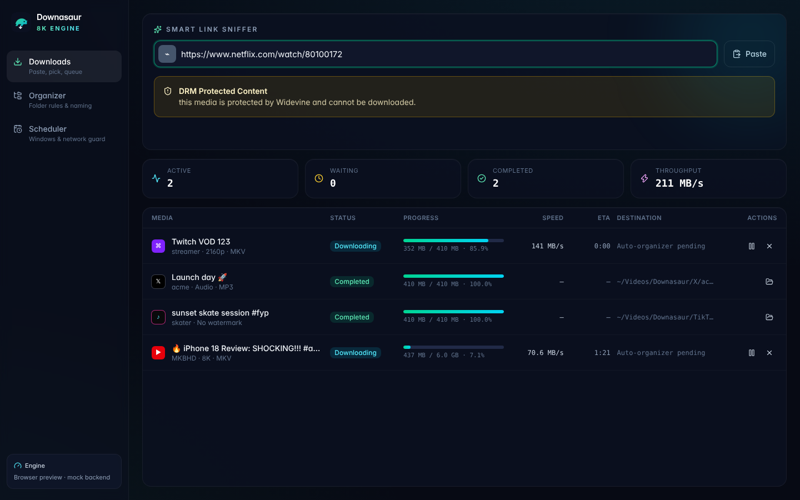
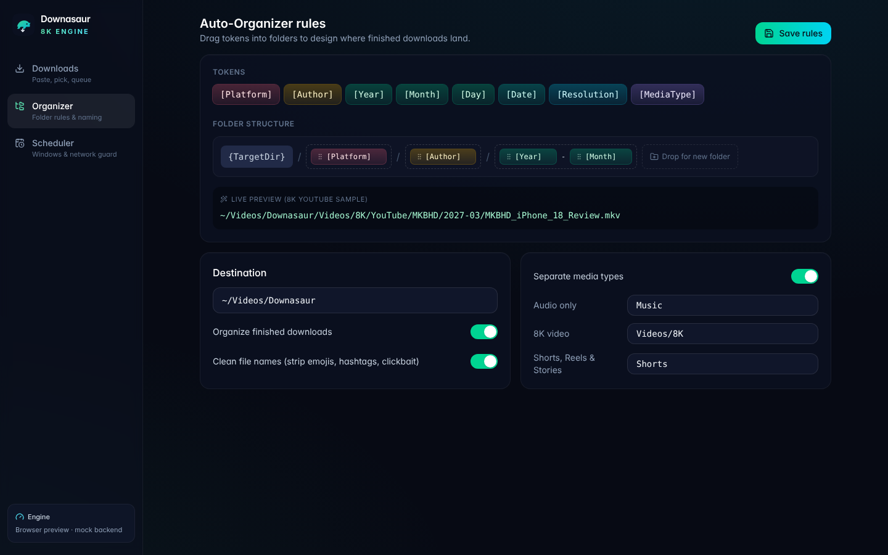

# Downasaur 8K

A cross-platform desktop video downloader built for very large media: 8K (4320p) AV1/VP9 streams, multi-gigabyte files, and queues of 100+ concurrent tasks. The engine is Rust; the shell is Tauri v2 with a React 19 + TypeScript + Tailwind CSS v4 interface.





## Repository layout

```text
.
├── Cargo.toml                    # Rust workspace, shared dependency versions and lints
├── package.json                  # pnpm workspace scripts (dev, build, check)
├── crates/
│   └── downasaur-core/           # UI-agnostic engine library
│       └── src/
│           ├── extractors/       # PlatformExtractor trait + registry
│           │   ├── youtube/      #   urls, formats (8K itags), signature cipher, playlist/channel crawl
│           │   ├── tiktok/       #   rehydration JSON, clean (no-overlay) renditions
│           │   ├── instagram/    #   posts, Reels, Stories (Stories need the user's own session)
│           │   ├── twitch/       #   GQL access token → Usher HLS master playlist
│           │   ├── twitter/      #   video_info variants, highest MP4 bitrate
│           │   ├── facebook/     #   inline GraphQL URLs + JSON-LD metadata
│           │   └── generic/      #   universal fallback via yt-dlp --dump-single-json
│           ├── net/              # reqwest pool: browser profiles, UA + proxy rotation, retry/backoff
│           ├── downloader/       # ranged chunks, BufWriter disk I/O, HLS VOD/live, rate limiter
│           ├── remux/            # FFmpeg stream-copy merge, rewrap, audio extraction, progress
│           ├── subtitles/        # track selection, WebVTT → SRT, embed or sidecar
│           ├── organizer/        # rule-based paths, media separation, clean naming
│           ├── scheduler/        # time windows, bandwidth cap, metered-network guard
│           ├── db/               # SQLite (WAL) queue, chunk state, settings
│           ├── progress/         # 60 fps coalescing progress hub
│           ├── drm.rs            # DRM detection (report only)
│           ├── selection.rs      # profile → concrete streams (8K AV1 > VP9 > HEVC > H.264)
│           └── engine.rs         # queue orchestration across every stage
└── apps/
    └── desktop/
        ├── src/                  # React 19 UI
        │   ├── features/sniffer/     # Smart Link Sniffer (clipboard + instant platform icon)
        │   ├── features/formats/     # Batch format picker (8K, audio-only, no watermark)
        │   ├── features/queue/       # Virtualized queue table + live stats
        │   ├── features/organizer/   # Drag-and-drop path pattern builder with live preview
        │   ├── features/scheduler/   # Download windows, bandwidth cap, metered guard
        │   └── lib/                  # typed command bridge, types mirroring Rust, mock backend
        └── src-tauri/            # Tauri v2 shell: commands, state, 60 fps event bridge
```

## Getting started

Prerequisites: Rust 1.90+, Node 22+, pnpm 10, and the [Tauri v2 system dependencies](https://v2.tauri.app/start/prerequisites/) for your OS. At runtime the engine calls `ffmpeg` (remuxing) and, for the universal fallback, `yt-dlp`; both must be on `PATH`.

```bash
pnpm install
pnpm dev          # Tauri app with hot reload
pnpm web:dev      # UI only in a browser, backed by a mock engine
pnpm build        # release bundle for the current OS
pnpm check        # typecheck + UI build + clippy (-D warnings) + all Rust tests
```

## How the pipeline works

1. **Route.** `ExtractorRegistry` picks the first `PlatformExtractor` whose `matches(url)` is true; anything else goes to the yt-dlp bridge.
2. **Extract.** The module returns `MediaInfo` (title, author, thumbnail, duration, formats, subtitles) or a `Collection` of entry URLs for playlists and channels. DRM manifests (Widevine, PlayReady, FairPlay) stop here with a `drm_protected` error, which the UI shows as **DRM Protected Content**.
3. **Select.** `selection::select` maps the chosen profile to streams: for Ultra HD 8K that is the best video-only stream at or below 4320p (AV1 preferred, then VP9) plus the best audio.
4. **Download.** HTTP resources are split into 32 MiB ranged chunks fetched over 8 connections, each writing through an 8 MiB `BufWriter`. Flushed progress per chunk is checkpointed to SQLite, so pause, crash or reboot resumes at the exact byte. HLS playlists are fetched segment by segment (in order), and live playlists are followed until `#EXT-X-ENDLIST`.
5. **Remux.** FFmpeg joins video and audio with `-c copy` (no re-encode), optionally muxing soft subtitles into MKV, and reports progress from `-progress pipe:1`.
6. **Organize.** The file moves to `{TargetDir}/{media dir?}/{pattern}/{clean name}.{ext}`; for example `Videos/Downasaur/Videos/8K/YouTube/MKBHD/2027-03/MKBHD_iPhone_18_Review.mkv`.

Progress from every stage goes through `ProgressHub`, which keeps only the latest update per task and emits one batched `downasaur://progress` event per frame (60 fps).

## Status

This is the initial scaffold. Everything above compiles with zero warnings and has unit tests for the parsing, selection, naming, scheduling, persistence and FFmpeg argument logic. The following are deliberately left for follow-up work:

- Platform modules are verified against recorded payloads only, not live sites; site responses change often and each module needs live integration tests.
- YouTube `n`-parameter throttling transform, AES-128 encrypted HLS segments, and DASH manifests are not implemented yet.
- Metered-network detection is implemented for Linux (NetworkManager); Windows and macOS report "unknown" until their native probes land.
- Clean naming is a deterministic heuristic behind a `TitleCleaner` trait, ready for a model-backed implementation.

## Responsible use

Downasaur only downloads media that is served without DRM. Protected streams are detected and reported, never decrypted. Only download content you have the right to save, and respect each platform's terms of service.
